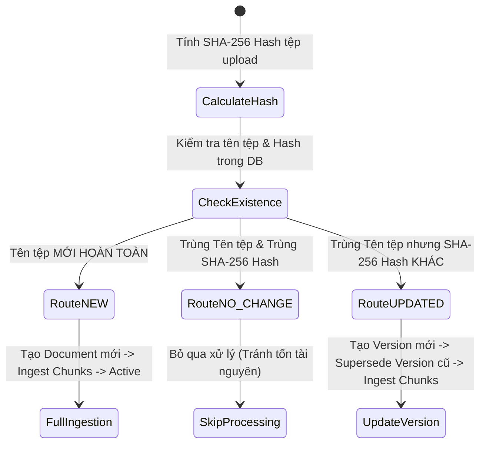
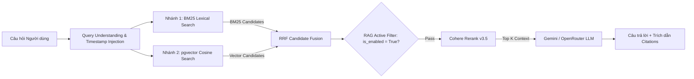
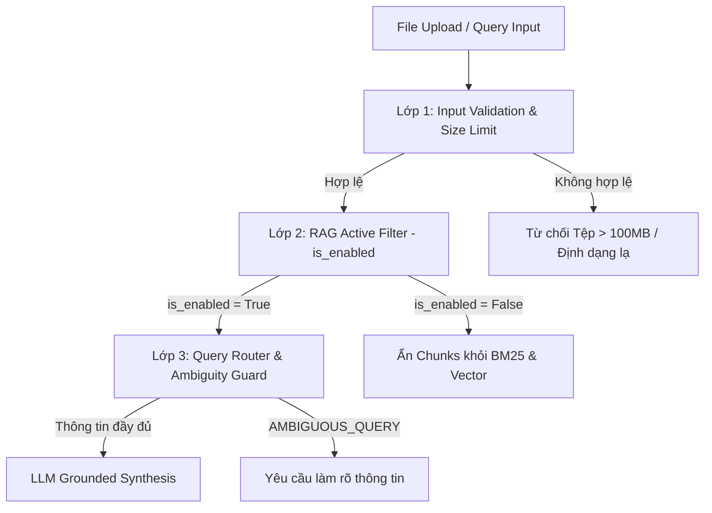

# TÀI LIỆU KỸ THUẬT KIẾN TRÚC & ĐẶC TẢ HỆ THỐNG KNOWLEDGE-LOADER
*(Knowledge-Loader Enterprise RAG System Architecture & Technical Specification)*

---

## MỤC LỤC
1. [Chương 1: Tổng quan Kiến trúc Dự án (System Architecture Overview)](#chuong-1-tong-quan-kien-truc-du-an)
2. [Chương 2: Mô hình Dữ liệu & Lưu trữ (Data Models & Storage Schema)](#chuong-2-mo-hinh-du-lieu--luu-tru)
3. [Chương 3: Luồng Ingestion & Động cơ Parser Đa Định dạng (Ingestion & Multi-Format Parsers)](#chuong-3-luong-ingestion--dong-co-parser-da-dinh-dang)
4. [Chương 4: Động cơ Tóm tắt Tài liệu & Tìm kiếm Lai Dual Retrieval (Summarization & Dual Retrieval Engine)](#chuong-4-dong-co-tom-tat-tai-lieu--tim-kiem-lai-dual-retrieval)
5. [Chương 5: Bảo mật & Quản lý Quyền Truy cập (Security & Control Guards)](#chuong-5-bao-mat--quan-ly-quyen-truy-cap)
6. [Chương 6: Giao diện Web Frontend & Trải nghiệm Người dùng (Web Frontend Specs)](#chuong-6-giao-dien-web-frontend--trai-nghiem-nguoi-dung)
7. [Chương 7: Hướng dẫn Vận hành, Deployment & Troubleshooting](#chuong-7-huong-dan-van-hanh-deployment--troubleshooting)

---

<a id="chuong-1-tong-quan-kien-truc-du-an"></a>
## CHƯƠNG 1: TỔNG QUAN KIẾN TRÚC DỰ ÁN (SYSTEM ARCHITECTURE OVERVIEW)

### 1.1. Mục tiêu Hệ thống
Dự án **Knowledge-Loader** là giải pháp nạp tri thức tự động và Trợ lý AI Chat thông minh dành cho doanh nghiệp. Hệ thống tiếp nhận các định dạng tài liệu văn phòng phổ biến (**PDF, DOCX, XLSX, CSV, PPTX, MD**), tự động phân tích cấu trúc, chia nhỏ dữ liệu (Chunking), tạo chỉ mục ngữ nghĩa (Vector Embedding) kết hợp tra cứu từ khóa chính xác (BM25) để cung cấp câu trả lời có trích dẫn nguồn chuẩn xác (Citation-grounded Answers).

```mermaid
flowchart TD
    Client[Web Client - React/Vite] -->|REST API / Streaming| FastAPI[FastAPI Backend Server]
    FastAPI -->|Async Worker Claim| Worker[Processing Worker]
    
    subgraph Multi-Format Parsers
        Worker --> PDF[PDF Page-Aware Parser]
        Worker --> DOCX[DOCX/MD Header Parser]
        Worker --> XLSX_A[XLSX Mode A: Timeline Engine]
        Worker --> XLSX_B[XLSX Mode B: Key-Value / Table Engine]
    end

    Multi-Format Parsers --> Chunker[Token-Budget Chunker]
    Chunker --> Embedder[Gemini / OpenRouter Embedding]

    Embedder -->|Save Embeddings & Metadata| Postgres[(PostgreSQL + pgvector)]
    Chunker -->|Index Active Chunks| BM25[In-Memory BM25 Index]

    FastAPI -->|Dual Hybrid Search| Retriever[Retrieval Service]
    Retriever -->|BM25 Keyword Search| BM25
    Retriever -->|Vector Similarity Search| Postgres
    Retriever -->|RRF Fusion + Cohere Rerank| Reranker[Cohere Rerank Service]
    Reranker -->|Context Context + System Timestamp| Gemini[Gemini / OpenRouter LLM]
    Gemini -->|Streaming Response + Citations| Client
```

### 1.2. Danh mục Công nghệ (Technology Stack)

| Lớp (Layer) | Công nghệ / Thư viện | Trách nhiệm chính |
| :--- | :--- | :--- |
| **Backend Framework** | Python 3.11, FastAPI, Uvicorn | Xây dựng RESTful API, quản lý WebSocket/Streaming, xử lý Authentication (JWT), và điều phối pipeline Ingestion. |
| **Database & Vector** | PostgreSQL 16, `pgvector` | Lưu trữ cấu trúc metadata (`documents`, `document_versions`, `document_chunks`), lưu trữ vector embedding (768/1536 chiều). |
| **Lexical Search** | `rank-bm25` (BM25Okapi) | Tìm kiếm từ khóa chính xác cho mã tài liệu, tên quy trình, mã linh kiện và thuật ngữ chuyên ngành hiếm. |
| **Reranking Engine** | Cohere Rerank API (`rerank-v3.5`) | Tái xếp hạng các candidates trích xuất từ BM25 và Vector Search để chọn Top Context chính xác nhất. |
| **LLM & Embedding** | Gemini 1.5 Pro / Flash, OpenRouter | Sinh Vector Embedding cho chunks và tổng hợp câu trả lời dựa hoàn toàn trên Context được cung cấp. |
| **Document Parsers** | PyMuPDF (`fitz`), MarkItDown, openpyxl, pandas | Trích xuất văn bản theo trang (PDF), cấu trúc heading (DOCX/MD) và xử lý bảng dữ liệu/timeline (XLSX/CSV). |
| **Frontend Framework** | React 18, Vite, Lucide React, KaTeX | Giao diện người dùng ChatGPT-style, hiển thị bảng biểu, công thức toán học, thẻ Citation và quản lý tài liệu Admin. |
| **Containerization** | Docker, Docker Compose | Vận hành toàn bộ hệ thống dưới dạng 4 Docker containers độc lập. |

---

<a id="chuong-2-mo-hinh-du-lieu--luu-tru"></a>
## CHƯƠNG 2: MÔ HÌNH DỮ LIỆU & LƯU TRỮ (DATA MODELS & STORAGE SCHEMA)

Hệ thống sử dụng PostgreSQL kết hợp tiện ích mở rộng `pgvector` làm cơ sở dữ liệu quan hệ và vector chính.

### 2.1. Cấu trúc Các Bảng Dữ liệu Chính (Database Schemas)

#### 1. Bảng `documents`
Quản lý thông tin tổng quan của tệp tri thức được tải lên hệ thống.

```sql
CREATE TABLE documents (
    id VARCHAR(36) PRIMARY KEY,               -- UUID v4 định danh tài liệu
    original_file_name VARCHAR(255) NOT NULL, -- Tên tệp gốc khi upload
    file_type VARCHAR(20) NOT NULL,           -- Loại tệp: pdf, docx, xlsx, csv, pptx, md
    file_path VARCHAR(512) NOT NULL,          -- Đường dẫn lưu tệp vật lý trên ổ đĩa
    status VARCHAR(36) DEFAULT 'PENDING',     -- PENDING, PROCESSING, READY, FAILED, REQUIRES_OCR
    routing_result VARCHAR(36) DEFAULT 'NEW', -- NEW, UPDATED, NO_CHANGE
    active_version_id VARCHAR(36),            -- Foreign key chỉ tới phiên bản đang hoạt động
    is_enabled BOOLEAN DEFAULT TRUE,          -- Trạng thái Bật/Tắt RAG per document
    error_message TEXT,                       -- Chi tiết lỗi nếu status = FAILED
    created_at TIMESTAMP DEFAULT CURRENT_TIMESTAMP,
    updated_at TIMESTAMP DEFAULT CURRENT_TIMESTAMP
);
```

#### 2. Bảng `document_versions`
Quản lý lịch sử các phiên bản của tệp nhằm phục vụ cơ chế kiểm soát phiên bản (Version Control).

```sql
CREATE TABLE document_versions (
    id VARCHAR(36) PRIMARY KEY,               -- UUID v4 định danh phiên bản
    document_id VARCHAR(36) NOT NULL REFERENCES documents(id) ON DELETE CASCADE,
    version_number INT NOT NULL,              -- Số phiên bản: 1, 2, 3...
    file_hash VARCHAR(64) NOT NULL,           -- SHA-256 hash của tệp
    created_at TIMESTAMP DEFAULT CURRENT_TIMESTAMP
);
```

#### 3. Bảng `document_chunks`
Lưu trữ nội dung chi tiết từng đoạn tri thức (chunk), định vị trích dẫn (citation) và vector embedding.

```sql
CREATE TABLE document_chunks (
    id VARCHAR(36) PRIMARY KEY,               -- UUID v4 định danh chunk
    document_id VARCHAR(36) NOT NULL REFERENCES documents(id) ON DELETE CASCADE,
    version_id VARCHAR(36) NOT NULL REFERENCES document_versions(id) ON DELETE CASCADE,
    chunk_index INT NOT NULL,                 -- Thứ tự chunk trong tệp (0, 1, 2...)
    content TEXT NOT NULL,                    -- Nội dung văn bản chi tiết của chunk
    embedding vector(768),                    -- Dense Vector Embedding (Gemini 768 chiều)
    
    -- Citation & Localization Metadata
    sheet_name VARCHAR(128),                  -- Tên Sheet (dành cho XLSX/CSV)
    page_start INT,                           -- Trang bắt đầu (dành cho PDF)
    page_end INT,                             -- Trang kết thúc (dành cho PDF)
    heading_path TEXT,                        -- Đường dẫn Tiêu đề (dành cho DOCX/MD)
    row_range VARCHAR(64),                    -- Khoảng dòng dữ liệu (dành cho XLSX/CSV)
    
    created_at TIMESTAMP DEFAULT CURRENT_TIMESTAMP
);

-- Index tối ưu hóa tìm kiếm Vector Cosine Similarity
CREATE INDEX idx_document_chunks_embedding 
ON document_chunks USING hnsw (embedding vector_cosine_ops);
```

#### 4. Bảng `processing_jobs`
Quản lý các công việc xử lý ngầm (Background Ingestion Jobs) và cơ chế khóa dòng (Row Locking) chống xung đột multi-worker.

```sql
CREATE TABLE processing_jobs (
    id VARCHAR(36) PRIMARY KEY,
    document_id VARCHAR(36) NOT NULL REFERENCES documents(id) ON DELETE CASCADE,
    stage VARCHAR(64) NOT NULL,               -- PARSING, CHUNKING, EMBEDDING, INDEXING
    status VARCHAR(36) DEFAULT 'PENDING',     -- PENDING, PROCESSING, COMPLETED, FAILED
    retry_count INT DEFAULT 0,
    locked_by VARCHAR(128),                   -- Worker ID đang xử lý
    created_at TIMESTAMP DEFAULT CURRENT_TIMESTAMP,
    updated_at TIMESTAMP DEFAULT CURRENT_TIMESTAMP
);
```

### 2.2. Trạng thái Bật/Tắt RAG per Document (`is_enabled`)
Trường `is_enabled` (BOOLEAN) cho phép Quản trị viên Bật/Tắt truy vấn RAG đối với từng tệp tài liệu cụ thể ngay trên Giao diện Web Admin. 
- Khi `is_enabled = FALSE`, toàn bộ các `document_chunks` thuộc tài liệu này tự động bị loại khỏi câu truy vấn SQL pgvector và BM25 index mà không cần xóa dữ liệu gốc khỏi Database.

---

<a id="chuong-3-luong-ingestion--dong-co-parser-da-dinh-dang"></a>
## CHƯƠNG 3: LUỒNG INGESTION & ĐỘNG CƠ PARSER ĐA ĐỊNH DẠNG (INGESTION & MULTI-FORMAT PARSERS)

### 3.1. Cơ chế Routing Phiên bản Tài liệu (Document Version Routing)
Khi người dùng tải lên một tệp tài liệu, hệ thống tính toán chuỗi mã hóa **SHA-256 hash** của tệp và so sánh với lịch sử lưu trữ:



1. **`NEW`**: Tệp chưa từng tồn tại -> Khởi tạo `document` mới, chạy trọn vẹn pipeline Ingestion.
2. **`UPDATED`**: Tệp trùng tên với một tài liệu cũ nhưng có nội dung SHA-256 mới -> Tạo phiên bản `document_version` mới, cập nhật `active_version_id` chỉ sang phiên bản mới. Các chunks của phiên bản cũ bị ẩn khỏi tìm kiếm Active RAG.
3. **`NO_CHANGE`**: Tệp trùng tên và trùng khớp hoàn toàn SHA-256 hash -> Bỏ qua không tốn tài nguyên xử lý lại.

---

### 3.2. Động cơ Parser Đa Định dạng ([parser_service.py](file:///c:/Users/khanhtd34/Desktop/VSF/Knowledge-Loader/backend/app/services/parser_service.py))

#### 1. PDF Parser (Page-Aware Extractor)
- Trích xuất nội dung văn bản theo từng trang sử dụng PyMuPDF (`fitz`) hoặc MarkItDown.
- Lưu trữ chính xác vị trí `page_start` và `page_end` cho từng đoạn tri thức.
- Nếu mật độ văn bản (Text Density) của tệp PDF quá thấp (PDF dạng ảnh quét scan không chứa text layer), tài liệu được gắn trạng thái `REQUIRES_OCR` để chờ xử lý OCR chuyên dụng.

#### 2. DOCX / MD Parser (Header Hierarchy Extractor)
- Trích xuất cấu trúc cây tiêu đề (`# Heading 1 -> ## Heading 2 -> ### Heading 3`).
- Lưu trữ chuỗi `heading_path` trong metadata chunk (ví dụ: `Tổng quan > Quy trình kiểm tra > Bước 1`) giúp AI hiểu đúng bối cảnh đoạn văn bản nằm dưới mục nào.

#### 3. XLSX / CSV Advanced Parser (2 Mode Độc quyền)

##### **MODE A: Động cơ Phân tích Bảng Tiến độ / Gantt (Timeline Aggregation Engine)**
Tự động kích hoạt khi tệp Excel chứa bảng kế hoạch tiến độ có số cột lớn ($\ge 12$ cột) và nhiều cột ngày tháng ($\ge 4$ cột ngày).

- **Multi-Row Header Resolution:** Đọc và tổng hợp dòng tiêu đề bị gộp (Merged Header Cells) nằm trong **10 dòng đầu tiên** của Sheet (ví dụ Row 4 chứa tiêu đề `STT`, `Tên công việc`, `PIC`; Row 5 chứa các mốc ngày tháng `13/07/2026`, `14/07/2026`).
- **Phân tách Cột Chuẩn xác:**
  - `PIC` (Person / Team in Charge): Tự động gộp thông tin người phụ trách và team phụ trách (ví dụ: `Tường (DE)` hoặc `Cẩm Linh (DA)`).
  - `Trạng thái` & `Tiến độ`: Tách biệt độc lập cột `Status` (`Completed`, `Pending`, `In Progress`) và cột `% Tiến độ`.
  - **Tránh nhầm lẫn STT:** Hệ thống ngăn chặn việc nhầm lẫn số thứ tự công việc (`5`, `6`, `7`) với số phần trăm tiến độ (`5%`, `6%`). Các giá trị số thập phân như `0.5`, `0.8`, `1.0` được tự động chuyển đổi thành `50%`, `80%`, `100%`.
  - **Mốc thời gian:** Tự động gom các cột mốc thời gian chạy dài thành khoảng ngày cụ thể (ví dụ: `13/07/2026 – 17/07/2026`).

##### **MODE B: Động cơ Phân đoạn Bảng Dữ liệu (Segmented Tables Engine)**
Dành cho các tệp Excel kế toán, báo cáo tổng hợp hoặc bảng tra cứu:

- **Bảng Tóm tắt 2 Cột (Key-Value Summary Sheets):** Định dạng trực tiếp dưới dạng danh sách chuỗi thô phân cách bởi dấu gạch đứng `Key | Value` (ví dụ `Doanh thu | 100.000.000 VNĐ`), không sử dụng khung bảng rườm rà.
- **Bảng Dữ liệu Rộng (Large Sheets Guardrail):**
  - Giới hạn tối đa **12 cột quan trọng nhất** per chunk để tránh tràn token.
  - Áp dụng Token Budget sampling (~650 ký tự max per block).
  - **Dòng lưu ý Inline:** Đối với các Sheet chỉ chứa 1 chunk duy nhất nhưng còn dữ liệu hàng phía sau, tự động chèn dòng lưu ý inline ngay cuối chunk đầu tiên: `*(Lưu ý: Sheet này còn dữ liệu các hàng phía dưới...)*`.

---

### 3.3. Động cơ Chunking theo Token Budget ([chunking_service.py](file:///c:/Users/khanhtd34/Desktop/VSF/Knowledge-Loader/backend/app/services/chunking_service.py))

- **Cấu hình Token Budget:**
  - **Target Chunk Size:** 700 – 900 tokens.
  - **Maximum Chunk Size:** 1.100 – 1.200 tokens.
  - **Overlap:** 80 – 120 tokens (~10 – 15%).
  - **Minimum Post-Merge:** 200 – 250 tokens.
- **Quy tắc Bảo vệ Toàn vẹn (Boundary Protection):**
  - Không bao giờ xé lẻ các dòng lưu ý `*(Lưu ý: Sheet ...)*`.
  - Giữ nguyên khối các tiêu đề Markdown (`###`) và các bảng dữ liệu nhỏ không bị cắt đôi giữa chừng.

---

<a id="chuong-4-dong-co-tom-tat-tai-lieu--tim-kiem-lai-dual-retrieval"></a>
## CHƯƠNG 4: ĐỘNG CƠ TÓM TẮT TÀI LIỆU & TÌM KIẾM LAI DUAL RETRIEVAL (SUMMARIZATION & DUAL RETRIEVAL ENGINE)

### 4.1. Động cơ Tóm tắt Dữ liệu Tài liệu ([tomtat_service.py](file:///c:/Users/khanhtd34/Desktop/VSF/Knowledge-Loader/backend/app/services/tomtat_service.py))
Hệ thống cung cấp dịch vụ `TomTatService` chuyên trách trích xuất tóm tắt cấp tài liệu (Document-Level Summary):
- Tự động rút gọn các nội dung cốt lõi, chỉ số KPI chính và danh mục công việc của từng tệp tri thức khi được upload.
- Hỗ trợ câu hỏi tổng quát của người dùng như *"Tóm tắt nội dung chính của tài liệu X"* mà không cần duyệt qua từng chunk chi tiết.

---

### 4.2. Động cơ Tìm kiếm Lai 2 Nhánh (Dual Hybrid Search Pipeline)



#### 1. Nhánh 1: BM25 Lexical Search (Rank-BM25)
- Tra cứu theo tần suất xuất hiện từ khóa chính xác (Exact Keyword Matching).
- Đặc biệt hiệu quả với các truy vấn chứa: Mã tài liệu, mã quy trình, tên tệp, mã linh kiện, số tiền chứng từ kế toán hoặc tên riêng người phụ trách (`PIC`).

#### 2. Nhánh 2: Dense Vector Similarity Search (pgvector)
- Chuyển đổi câu hỏi thành Vector Embedding (768 chiều).
- Thực hiện tính toán khoảng cách Cosine Similarity với tập `document_chunks` trong PostgreSQL.
- Đặc biệt hiệu quả với các câu hỏi tìm kiếm theo ngữ nghĩa (Semantic Search) hoặc diễn đạt theo từ đồng nghĩa.

#### 3. Dung hợp Kết quả (Reciprocal Rank Fusion - RRF)
Kết quả từ 2 nhánh được tổng hợp và xếp hạng lại bằng công thức RRF:

$$RRF\_Score(d) = \sum_{m \in \{BM25, Vector\}} \frac{1}{k + r_m(d)}$$

*(trong đó $k = 60$, $r_m(d)$ là thứ hạng của chunk $d$ trong nhánh $m$)*.

#### 4. Cohere Rerank (`rerank-v3.5`)
Tập candidates sau khi hợp nhất RRF được gửi tới Cohere Rerank API để đánh giá độ liên quan ngữ cảnh trực tiếp với câu hỏi gốc, chọn ra **Top $K$ Context chunks** chất lượng nhất đưa vào Prompt của LLM.

---

### 4.3. Định tuyến Truy vấn & Xử lý Câu hỏi Mơ hồ (Query Router & Directives)

#### 1. Truyền Thời gian Hệ thống (System Timestamp Injection)
Hệ thống tự động chèn ngày giờ hệ thống thời gian thực (`Current System Timestamp: YYYY-MM-DD HH:mm:ss`) vào đầu Prompt gửi tới LLM. 
- Giúp AI hiểu và xử lý chuẩn xác 100% các câu hỏi chứa mốc thời gian tương đối như: *"từ bây giờ đến cuối năm"*, *"các dự án trong tháng này"*, *"kế hoạch tuần sau"*.

#### 2. Xử lý Câu hỏi Mơ hồ (`AMBIGUOUS_QUERY`)
Khi Router phát hiện câu hỏi của người dùng quá ngắn hoặc thiếu thông tin phạm vi quan trọng (ví dụ: *"cho tôi xem tiến độ"* mà không nói rõ tiến độ dự án nào):
- Backend không để LLM tự bịa câu trả lời.
- Hệ thống lập tức gán nhãn `AMBIGUOUS_QUERY` và trả về thông điệp làm rõ mẫu chuẩn:
  > *"Rất tiếc, câu hỏi của bạn chưa đủ thông tin chi tiết. Vui lòng cung cấp thêm tên dự án, tên tài liệu hoặc mã quy trình cụ thể để hệ thống tra cứu chính xác."*

---

<a id="chuong-5-bao-mat--quan-ly-quyen-truy-cap"></a>
## CHƯƠNG 5: BẢO MẬT & QUẢN LÝ QUYỀN TRUY CẬP (SECURITY & CONTROL GUARDS)

Dự án áp dụng cơ chế kiểm soát bảo mật và an toàn dữ liệu thực tế gồm 3 lớp:



1. **Lớp 1: Input Validation & File Limit Guard:**
   - Chỉ tiếp nhận các tệp có định dạng cho phép: `.pdf`, `.docx`, `.doc`, `.xlsx`, `.xls`, `.csv`, `.pptx`, `.ppt`, `.md`.
   - Giới hạn dung lượng tệp tối đa **100MB**. Tệp vượt quá 100MB bị từ chối ngay tại API gateway.
2. **Lớp 2: Administrative RAG Toggle Control (`is_enabled`):**
   - Quản trị viên có quyền Bật/Tắt RAG cho bất kỳ tài liệu nào trên giao diện Admin.
   - Các tài liệu bị Tắt RAG sẽ ngay lập tức ngắt khỏi luồng tìm kiếm BM25 và pgvector, bảo vệ dữ liệu nhạy cảm không bị đưa vào Context.
3. **Lớp 3: Audit Logging & Exception Handling:**
   - Toàn bộ nhật ký xử lý công việc (`processing_jobs`), lỗi phân tích file và lịch sử hội thoại chat được ghi nhận đầy đủ vào PostgreSQL để phục vụ tra cứu kiểm toán.

---

<a id="chuong-6-giao-dien-web-frontend--trai-nghiem-nguoi-dung"></a>
## CHƯƠNG 6: GIAO DIỆN WEB FRONTEND & TRẢI NGHIỆM NGƯỜI DÙNG (WEB FRONTEND SPECS)

Giao diện Web Frontend được thiết kế theo phong cách ChatGPT hiện đại, tối ưu hóa mật độ hiển thị (Layout Density) vừa vặn 100% viewport.

### 6.1. Quy chuẩn Thiết kế (Design System & Layout Metrics)
- **Base Font Size:** `13.5px` (Giúp toàn bộ giao diện hiển thị gọn đẹp ở mốc 100% zoom mặc định, tương đương mức 80% browser zoom cũ, không bị khoảng trống đen thừa).
- **Theme:** Dark Mode Glassmorphism (`#212121` main background, `#171717` sidebar, viền mờ `rgba(255, 255, 255, 0.08)`).
- **Typography:** Font chữ Inter (Google Fonts) kết hợp KaTeX render công thức toán học.

### 6.2. Các Giao diện Màn hình Chính

#### 1. Trang Quản lý Tài liệu Tri thức (Admin Documents Portal)
- **Bảng Quản lý 9 Cột Hợp nhất:** Hiển thị trọn vẹn 9 cột thông tin mà không xuất hiện thanh cuộn ngang rườm rà:
  `Tên tài liệu` | `Định dạng` | `Routing` | `Trạng thái` | `Số Chunks` | `Bật RAG` | `Chi tiết` | `Reprocess` | `Delete`.
- **Thao tác Bật/Tắt RAG 1-Click:** Nút công tắc Power hỗ trợ bật/tắt quyền tra cứu RAG tức thì.

#### 2. Trang Trợ lý AI Chat (Chat Assistant Page)
- **Sidebar Co giãn Fluid (Width `240px`):** Không bị đè chữ, hiển thị trọn vẹn icon Sáng/Tối, nút ẩn Menu `<`, thông tin Admin và nút Đăng xuất `[->`.
- **Khung Chat Rộng `820px` (92% Viewport):**
  - Hiển thị Markdown chuẩn định dạng, bảng dữ liệu gọn gàng.
  - Các thẻ trích dẫn nguồn (Citation Tags `[S1] 00_tong_quan_datamodel.md`) nằm biệt lập rõ ràng phía trên khung nhập câu hỏi, không bị chèn hay đè lên nút *"Chế độ Lịch sử (History Mode)"*.

---

<a id="chuong-7-huong-dan-van-hanh-deployment--troubleshooting"></a>
## CHƯƠNG 7: HƯỚNG DẪN VẬN HÀNH, DEPLOYMENT & TROUBLESHOOTING

### 7.1. Cấu trúc Containers Docker Compose
Hệ thống đóng gói dưới dạng Docker Compose gồm 4 dịch vụ:

| Container Name | Image / Service | Port Mapping | Trách nhiệm |
| :--- | :--- | :--- | :--- |
| `graphrag_frontend` | Nginx Alpine (Vite Build) | `80:80` | Phục vụ Web UI Single Page Application & Nginx Reverse Proxy. |
| `graphrag_backend` | Python 3.11 FastAPI | `8000:8000` | Xử lý REST API, WebSocket, Ingestion Worker & RAG Engine. |
| `graphrag_postgres` | PostgreSQL 16 + pgvector | `5432:5432` | Lưu trữ Metadata quan hệ và Vector Embeddings. |
| `graphrag_neo4j` | Neo4j Community | `7474:7474`, `7687:7687` | Lưu trữ đồ thị phụ trợ (phục vụ mở rộng tương lai). |

### 7.2. Lệnh Vận hành & Triển khai (Deployment Commands)

```bash
# 1. Khởi động toàn bộ dịch vụ dưới dạng Daemon
docker compose up -d

# 2. Rebuild lại riêng Frontend sau khi thay đổi giao diện/CSS
docker compose build frontend
docker compose up -d frontend

# 3. Rebuild lại Backend sau khi cập nhật Logic Python
docker compose build backend
docker compose up -d backend

# 4. Xem nhật ký hoạt động (Logs) của Backend
docker logs -f graphrag_backend
```

### 7.3. Quy trình Kiểm tra & Troubleshooting

#### 1. Kiểm tra Kết nối Database & Số lượng Chunks
Sử dụng script Python nội bộ để kiểm tra số lượng Chunks đã được lưu trữ trong PostgreSQL:

```bash
docker exec -e PYTHONPATH=/app graphrag_backend python /app/storage/compare_db_chunks.py
```

#### 2. Kiểm tra Trạng thái Status / Progress của Tệp Excel Tiến độ
Sử dụng script kiểm tra kết quả phân tách Mode A Timeline:

```bash
docker exec -e PYTHONPATH=/app graphrag_backend python /app/storage/debug_khhd_status.py
```

---
*Tài liệu Kỹ thuật Hệ thống Knowledge-Loader được cập nhật lần cuối vào: 25/08/2026.*
